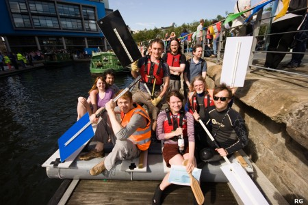
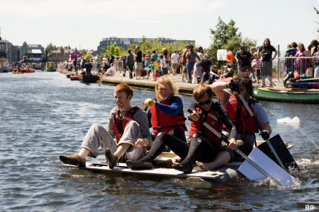
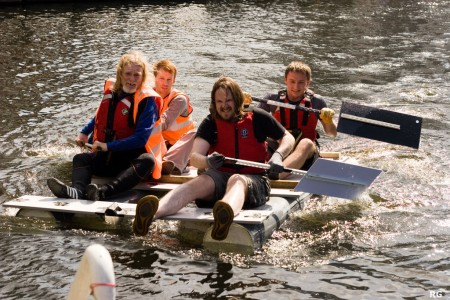
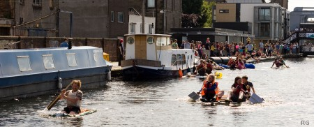

It was a day that would go down in history. The lessons learned from the attempts and failures of the previous years finally resulted in the victory that we had been so longing for. And no, I'm not talking about Andy Murray's victory at Wimbledon - the Hacklab won the Edinburgh Canal Festival Raft Race, and in record time too!

\[caption id="attachment\_1687" align="aligncenter" width="450"\] Some of the crew and supporters\[/caption\]

From our experimental fitness ball beginnings, to the over-engineered (or perhaps over-complicated) bicycle-and-paddle-wheel contraption last year, this time we knew we had to approach things differently - keep it simple. Some might argue that perhaps that this isn't in the true Hacklab spirit, but on the other hand, we got together and came up with a basic, robust design that would do the job it was designed for well. And it paid off.

Something that did remain in the Hacklab spirit of raft building was the fact that most of the final assembly happened the night prior to the race, with the first float test taking place mere hours before the first heat. However, much prep work had been completed in the week running up to the race and materials had been sourced long before then.

Some large lengths of pipe had been identified next to a skip, and these were appropriated to form the basis of the raft and cut to size. Perhaps the biggest problem was coming up with a method to seal the gaping holes at each end of the pipe. Following on from Martin's earlier success with cutting large polystyrene blocks with a hot wire, the same approach was used to create 10cm thick bungs that combined with some laser-cut wood discs for re-enforcement, and copious amounts of expanding foam, was hoped would result in a watertight seal that would keep the water out and the raft afloat.

\[caption id="attachment\_1666" align="aligncenter" width="450"\] The crew on their maiden voyage\[/caption\]

By midnight on the Friday evening, the last polystyrene bungs had been cut and the cans of expanding foam emptied - perhaps not entirely where originally intended, as anyone who has ever used it before will attest is always the case. Paddles were constructed out of shelving supports and large pieces of plastic which in hindsight were perhaps a little heavy. Finally, the raft was to be held together with threaded rod looped around the pipes and secured into wooden supports made out of high density shelves that would also double up as seats. The raft was piled into the back of the van in kit form, with all the tools and materials required for the final assembly at the canal side.

Race day dawned warm and sunny, and it was time to introduce the raft to the water for the first time. After a cock-up in the initial water displacement calculations (Pro tip: Don't mix up radius and diameter, thanks Grace!), the raft design had to be modified earlier in the week, and we hoped we'd got it right this time. Luckily we had, and it floated well, supporting four people without any drama. It was removed from the water and the wait for the first heat began.

Three, two, one... Go! Team Hacklab were off! Picking up speed quickly, the opponent was left long behind in no time, and the fine canal-going craft and her crew reached the finish line in a record 5 minutes 11 seconds. We had done it - we were through to the next stage! In the scramble to remove the raft, which was feeling decidedly heavier than when it began, a paddle slipped into the water and dropped like a lead weight. Bart lost any hope of avoiding a drink of canal juice this year as he dove down to retrieve it.

With the raft returned to base at the start, it was clear the pipes were not entirely watertight, with a trickle of water coming out of at least two of them. The rate was deemed low enough to not be of any immediate concern, however. After what seemed like an age, the final race was announced. There were six rafts in the final in total, including a streamlined solo manned raft that looked like it would be tough competition. Having achieved the fastest time so far, the Hacklab was at the back of the grid, and would have to work very hard to overtake the other rafts.

\[caption id="attachment\_1668" align="aligncenter" width="450"\] The final battle-faced push for the finish\[/caption\]

Battle faces donned, the crew paddled as hard as they could, overtaking one raft, then the next, and then the next... Soon, it was just the solo manned raft remaining, and seeing that they were gaining, they knew they were in for a chance. A final hard push to the finish line saw the Hacklab overtake the raft and reach the finish line just ahead of the opponent. A mad scramble onto the jetty ensued, two paddles went into the drink, and the whistle shrilly signaled victory! We had done it, and clocked in at a time of 4 minutes and 27 seconds!

\[caption id="attachment\_1667" align="aligncenter" width="450"\] Gaining on the lead\[/caption\]

A big thank you to all the lab members and regulars who helped with the raft construction and came to support us at the canal side. And a special thanks to those that brandished paddles, namely Bart, Gandolf, John, Llyr, Peter and Sean.
