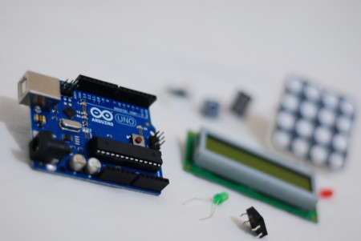

\[caption id="attachment\_1526" align="alignright" width="450"\] Photo by [beraldoleal](http://www.flickr.com/photos/beraldoleal/6297074604); - Creative Commons\[/caption\]

Arduino is a micro-controller platform designed for ease of use and learning. It allows the creation of electronically controlled projects, whether it be simple blinking lights, a robot or a music generator.

This workshop is aimed at beginners. You don't needs any previous electronics or programming knowledge or experience. Topics covered include:

- An introduction to the Arduino
- Using electronic components to build circuits
- Input and output
- Generating sound
- Expanding your Arduino
- And more!

If you already have an Arduino you can bring that along and just purchase a kit, otherwise choose the option to buy an Arduino and kit. All the other electronic components you need are provided in the kit. You will need to bring a laptop to program the Arduino with.

This is the third running of the popular workshop with the first two selling-out!

[Book now!](http://edinarduinoaug2013-ws.eventbrite.co.uk)

In the event that debit or credit cards aren't your thing please email treasurer@edinburghhacklab.com to arrange an alternative method of payment.
