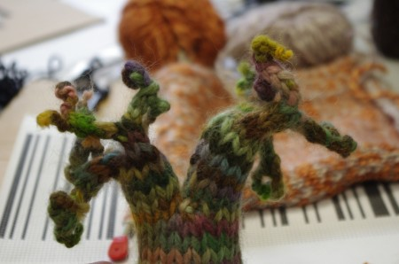
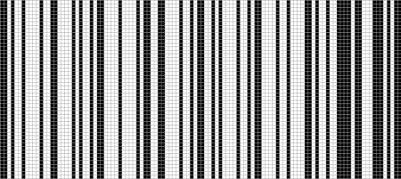

The August Craft Open night is this Wednesday (21st August) from 7:30pm. Come along \[[directions](http://edinburghhacklab.com/visit/ "Visit us")\] if you have craft projects to work on/discuss or your just curious.

The June craft night saw Madiline from [Botanica Mathematica](http://botanicamathematica.wordpress.com/) dropping by with some wonderful knitted/crocheted goodies, made by herself and others. These included several binary trees and other highly mathematical creations that I forget the details of..

\[caption id="attachment\_1723" align="aligncenter" width="450"\] Binary Tree\[/caption\]

Work started on several attempts at weaving a bar-code, with the aim that it might even be readable by a bar code scanner! A very simple drinking straw loom was soon joined by a loom fashioned out of scrap cardboard.

\[caption id="attachment\_1722" align="aligncenter" width="450"\] Pattern for a fabric barcode, no prizes for guessing what it scans as\[/caption\]

See you on Wednesday!
