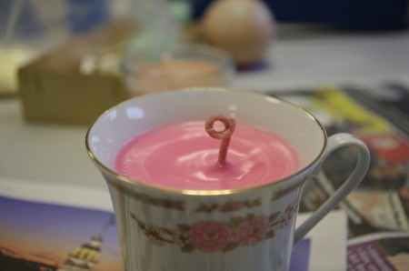

Want to make candles, but don't know where to start? The workshop covers some basic candle making theory before getting your hands dirty making candles. No previous experience is required just come along and have fun.

Topics covered will include:

- Different types of candle and wax
- How to safely melt and pour wax.
- Re-using wax successfully.

Bring along any remnants of burnt candles you have kicking about for reuse.

Date: Sunday 22nd September Time:11am to about 3:30pm, with a break for lunch

Tea and coffee will be provided, Summerhall has a cafe for food or you're welcome to bring a packed lunch. All materials are included in the workshop fee and you'll leave with at least one candle you've made.

[Register Now!](http://edincandle-sep2013-ws.eventbrite.co.uk)
