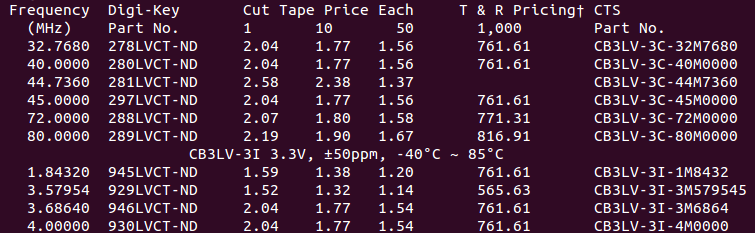
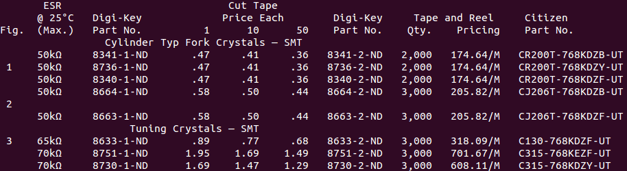
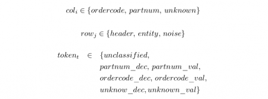
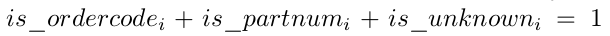
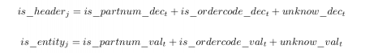
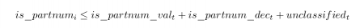
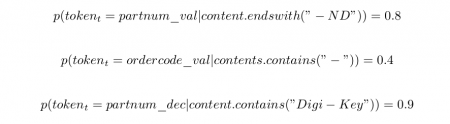
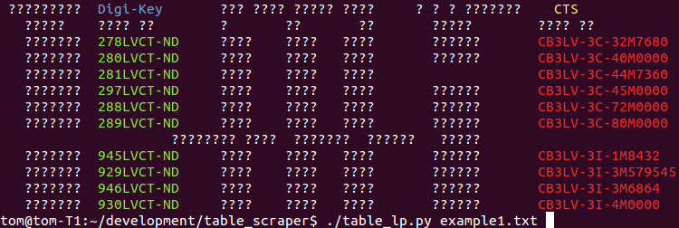
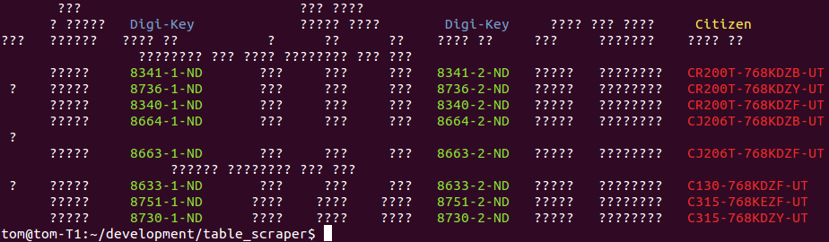

Recently I have been banging my head trying to import a ton of OCR acquired data expressed in tabular form. I think I have come up with a neat approach using probabilistic reasoning combined with mixed integer programming. The method is pretty robust to all sorts of real world issues. In particular, the method leverages topological understanding of tables, encodes it declaratively into a mixed integer/linear program, and integrates weak probabilistic signals to classify the whole table in one go (at sub second speeds). This method can be used for any kind of classification where you have strong logical constraints but noisy data.

Plain text tables are quite interesting when encountered in the wild. They are highly compressed forms of data, but that's a double edged sword, you can only understand the meaning of a particular table element if, and only if, you understand the meaning of the row and column it is found within. Unfortunately, the meaning of columns and rows vary wildly across a dataset of many independent tables. Consider the following abridged OCRed examples from the digikey catalogue (this work is for for [componentdeal.co.uk](http://www.componentdeal.co.uk)):-

(TLDR: scroll to the bottom to see the segmented results and skip the hard bit :p)

These tables have: differing spatial layout of header fields (e.g. “Cut Price Tape Each”), differing number of table header lines, different number of columns, and some rows are not data but actually hierarchical sub headings (e.g. “CB3LV-3I 3.3V, ±50ppm, -40°C ~ 85°C”). In the digikey world, ending in “-ND” is strong evidence that a token is a partnum, however, its not fool proof, as lots of non-partnums also end in -ND (its a huge catalogue). To decide whether “297LVCT-ND” is a product code, you need to reason over the entire table building up evidence. To do the inference I represent the table structuring elements (rows and columns) and the token labels as random categorical variables. A single character wide column is assigned a column type (ordercode, partnum) or unknown. A row is either a header, entity or noise. A token is either unclassified, a declarations of a column type (e.g. “Part No.”), or a value in a column type (e.g. “281LVCT-ND”).

The important thing in a table is that values and declaration tokens have to match types, and be consistent over an entire column. We can express these hard logical constraints using mixed integer programming (MIP). The first step is to encode the variables states into numerical variables. A categorical variable is split into a one-of-n vector encoding. For example, every column categorical variable becomes three integer variables each encoding a boolean state

We force one of the variables to be one by adding a linear constraint,  for each column i . We repeat this for the row and token catagoricals.

The next thing is to ensure that only declarations appear in header rows, and values in entity rows, for every row, j , and token, t .

The final set of constraints is ensuring each column contains declarations and values for a specific column type. Each token is one or more characters long, so each token intersects several single character wide columns. So for each token, t , and for every column intersecting that token, i we add the following constraints

(and the same for ordercode ) So at this point we have expressed the problem as a huge set of binary integer variables, with linear constraints between them. A MIP solver can now optimize any linear cost function involving those variables subject to those constraints. We choose our objective function to encode the probability of a particular labelling which we maximize to give the maximum likelihood estimate (which tells us which tokens are values) over all possible labellings.

Given a number of naive, independent, classifiers, their joint probability is their product, which is what we want to maximise.

The product term is not compatible with linear programming, so we note that the maximization result is not affected by taking logs, which usefully turns products into sums

This we can express as an objective function for our MIP. For this example I assign a probability of a token labeling based only on the content of the token. The three important cases I used were:

A catch all case when no specific clues are present is

You should theoretically fill in the missing combinations to make sure the probabilities add up to one, but in practice it does not matter too much (mine don't).

So now we can express our maximum likelihood estimate objective function as

This is in the form of a summation of constants multiplied by single unknowns, which a integer programming package like PuLP can solve very quickly. I have coded up this example in python to demonstrate how easy it is to encode (see [table\_lp.py](https://github.com/tomlarkworthy/table_scraper/blob/master/table_lp.py)).

Whilst integer programming is NP-hard to solve in general, these problem instances are not pathological instances. My computer solves the MLE problems in 0.3 and 0.2 seconds respectively, despite their being 953, and 1125 unknown boolean variables to assign. The output on the examples above are shown below. If a token was predicted to be ordercode or partnum, in a header or entity row, it is color coded.

What is particularly cool in these examples is that the system has labelled the partnum header correctly despite the naive classier having no information about this class. Its also managed to successful disambiguate extraneous tokens that contain “-” depite the parnum classifier being particularly weak at classifying.

The combination of mixed integer programming and probabilistic reasoning is powerful. When hard domain constraints are integrated with probability estimates, you can yield strong classifiers from relatively weak signals. Furthermore these problems can be solved quickly, and thanks to decent linear programming front ends like PuLP, they are not hard to program declaratively. I expect this kind of declarative scraper to be more accurate, easier to maintain and easier to document than an equivalent procedural rule based scraper.

#### Further Reading:

There are two main math subjects going on here. The first is linear programming, which is normally used to work out where to build factories under the guise of "operations research". The hard bit is expressing your domain, but Applied Mathematical Programming (1977) has a great [chapter](http://web.mit.edu/15.053/www/AMP-Chapter-09.pdf) coving many tactics for encoding problems.

We are not however, deciding, where to build factories. Maximum Likelihood Estimation is chapter 1 of Bayesian statistics, but not normally expressed with rich constraints. The insight is that the MLE estimate for \* independent\* observations has a form compatible with MIP, so you can model cool things. Books on Bayesian statistics get too complicated, too quickly though, so I am struggling to think of a book that doesn't go too abstract. [This](http://people.physics.anu.edu.au/~tas110/Teaching/Lectures/L3/Material/Myung03.pdf) paper is a tutorial for psychologists that is about the right level.
