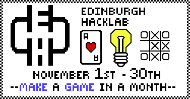

  Come join us Edinburgh for the second make-a-game-in-a-month, month. Stretch yourself creatively or technically to create something fun. Demo day is Sat. Nov 30th and open to the public, you can come to play other peoples games even if you're not authoring. Tell your friends!

<!--more--> You heard! Its that time of the year again, [#makgammon](https://twitter.com/#makgammon), make-a-game-in-a-month month. The first #makgammon was [last](http://edinburghhacklab.com/2012/10/make-a-game-month-makgammon/) year. The rules are the same:-

### Rules

Between 1st November and 29th November, make a game. Any sort of game. On 30th November, let someone else play your game. The winner is you.

### Tips from Tom

After struggling with an extremely long game development cycle from last year, this year I have personally decided to use a game development framework. I choose [Construct 2](https://www.scirra.com/construct2) because its HTML 5 only (no fancy GPU like Unity), and therefore it's trivial to run inside a virtual environment. I don't need to leave the comfort of my Linux desktop to make cross-platform games!

Since evaluating Contruct 2 I have totally fell in love with it and it has increased my productivity 10 fold in making prototypes. The GUI programming syntax is slightly annoying for a hardened dev, but time lost in expressing simple conditionals is gained by WYSIWYG level design, integrated physics and a lively plugin community. The system is extensible with JavaScript too, so really there is no upper bound. I love the framework so much I badgered them for prizes! (and I bought a personal license too!)

### Prizes

1st prize --- A Business License for Contruct 2 2nd and 3rd prize --- Personal License for Contruct 2

Using a framework is a simple way to get results fast if you are developing on a computer. Of course, #makgammon includes \*all\* types of gaming, not just computer games. #makgammon is purely intended as a fun thing to do for a month. A personal challenge, and a community trial by fire. Don't fret if your game's not finished, none of them were [last year](http://edinburghhacklab.com/2012/12/that-was-that-month-that-was-makgammon/)! Show us what you have got and share your experiences. Judging will not be done too seriously. I think we will just take a poll on demo day.

To keep up to date with announcements, join the Hacklab discussion [mailing list](http://edinburghhacklab.com/contact/). If you are feeling open, tell us about your game in the comments below.

Happy game developing!

Tom and Alex
