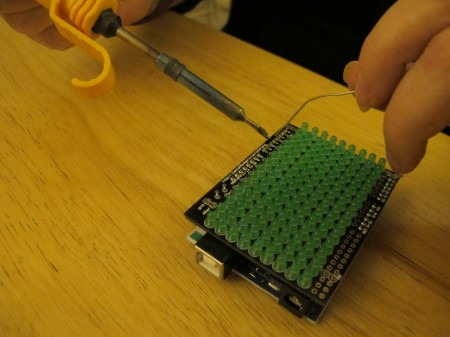

We quite often hear people saying "I'd love to get into electronics but i don't know how to solder" Although you can do lot of electronics including our [Arduino Workshop](http://edinarduinonov2013.eventbrite.co.uk/) without needing to solder, it quickly becomes a really handy skill to make you own projects and fix/hack electronics.

\[caption id="attachment\_1881" align="alignright" width="360"\] Photo by [Rain Rabbit](http://www.flickr.com/photos/37996583811@N01/5069107338/) – Creative Commons\[/caption\]

The workshop starts with the absolute basics, showing you the tools you'll use and demonstrating how to make a solder joint. You'll then get straight in there soldering your own [BlinkStick](http://www.blinkstick.com/) with help from experienced solderers.   Plug your completed BlinkStick into a computer and make pretty colours! If you would like to do this at the workshop please bring along a laptop.

The workshops takes place on Saturday 16 November from 2:30-5pm at Edinburgh Hacklab @ Summerhall and includes a BlinkStick kit (retail price £9.99) and tea/coffee.

We welcome younger participants, however for under 16's we request that a parent/carer is present for the duration of the workshop.

[Book Now](http://edinsoldernov2013.eventbrite.co.uk/)
