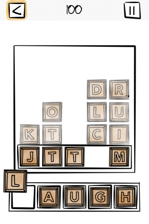
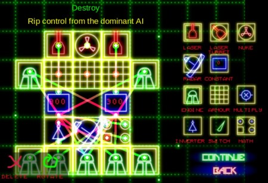
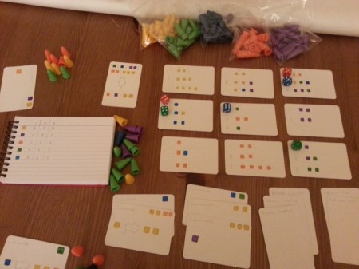
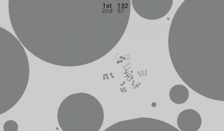
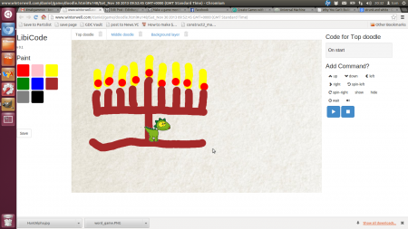
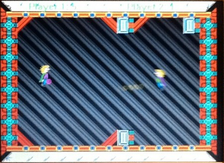

Ahhh, #makgammon, make-a-game-month, is over. I have semi-recovered from the development exhaustion. The single transferable votes have been counted. I have the results!

Before that I would like to say #makgammon was really amazing this year. We had 6 entries, all of which represented a significant contribution in different ways. The spread of games was broad, so there was something for everyone. This was represented in the votes! We asked people to order the games by personal preference (of the games they played). Those orderings were pretty random, indicating that at least someone really liked \*every\* game. So it just goes to show, you can't please everyone (so you should never try)! If a game dev did not win a prize, don't feel bad, because someone in our judging audience did like the concept.

That said, the games that did win did appear higher on average in most people's score sheet. So congrats to those for winning the mainstream appeal awards. Our prizes were kindly donated by [Scirra](https://www.scirra.com/) who make the game development software "Construct 2". I used that software to build Universal Machine, and I was blown away by how productive I was in 4 weeks. I think its fair to say that even if Universal Machine did not "win", it was the most complex game, indicating how useful Construct 2 is as a productivity tool. So without further "ado", the results... <!--more-->

### 1st Prize -- Coolson's Pocket Pack

By Emily Thomforde and Jamie Montgomerie

A fast-paced word game for one player, with elements of Scrabble and Tetris

For iPhone/iPad

Made in Xcode

Demo version finished in a month, plans to polish and release on iOS around Christmas.

Dev blog at [oneforeachhand](http://oneforeachhand.com)

### Joint 2nd place -- Universal Machine

By Tom Larkworthy (i.e. me)

A space ship building game inspired by modular robotics. A game secretly about programming that is actually fun! Design your ship then fight other ships in a 2D physics world.

You can play it [online](https://www.runesketch.com/static/dg/index.html)

### Joint 2nd place -- A Board game

By Tom Joyce

This as yet unnamed tabletop game focuses on tactical resource collection. Players take turns placing their "collectors" on cards spread out in a grid and then collect resources specified on the card. The position you choose to play your collector can open up new and more powerful moves for your opponent, so you have to think carefully. Players win by buying victory points with the resources they collect.

The game can be brought to an early end by the players, who can destroy chunks of the world rather than taking a normal turn. This allows for various rush strategies, and also the ability to vent your anger if you find yourself in last place!

### The rest in no particular order

#### Hunt

By Aleksandar Kodzhabashev

Android game and a life wallpaper where a fish swims in an 2D algae-filled world. Draw a net to catch the fish and score points to compete in the global ranklist. Be skillful, as fish runs away from you and hides under the algae. Use your tools wisely to become the best hunter! Available soon in Google Play Store. For alpha version and discussion join the [community](https://plus.google.com/communities/115908782160411367455)

#### Doodle

By Daniel Winterstein

This isn't a game, but an educational toy, which is kind of similar. It's a simple My-1st-Programming toy. I made it as a chanukah present for my young niece. I looked at etoys and Scratch, both good, but for an older audience.

So I aimed for something simpler for a 3-6 year old audience. [(online)](http://www.winterwell.com/daniel/game/doodle.html)

#### C++ ball game

By John Hawkins

Put on your anti-gravity cape and prepare for battle! Two players fly around the screen and try to hit each other with one of 2 balls. The ball can be aimed by the player's motion at the time it's released. Simple, but fast and furious!

Written in C for Windows with some ancient version of DirectX. The starting point was some test code which I'd made last Christmas of a guy flowing around the screen with inertia, and a routine to draw a map from blocks. In one week, this became a game with the addition of deadly balls, collision detection and scoring. The graphics are 'borrowed' from ZX Spectrum games, and the guy sprites were coloured in by me on an Amiga 500 about 20 years ago. It's not 100% finished, but it's my first game not in BASIC so I'm very pleased with the result.

**Tom's remarks:** The responsiveness of John's game needs to be experienced. The low level approach has certainly paid latency dividends. I really hope we see a progressed version of this next year with a scoring system.

### Closing statements

1st prize is a business license to Construct 2. The runners up get a personal license.

I would like to thank the players and the game developers for making #makgammon a great success this year. Hardly anyone told me they were developing a game, so I was very relieved to have 6 entries in the end! And I was really blown away by the quality of every entry. The feedback I have received is that everyone got something out of it. Game developers saw players interacting with their games naturally and it has given them a lot of feedback on how to improve things (its especially useful to see people fumble around your basic UI). Players all enjoyed the games and the atmosphere was awesome. We played board games afterwards!

I think it's almost certain we will doing this event next year. Budding developers, I look forward to seeing you there.
