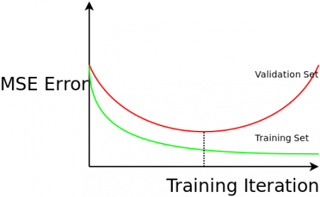

I have been irritated that many recent introductions to machine learning/neural networks/whatever that fail to emphasise the most import trick in machine learning. Many internet resources don't mention it, and even good textbooks often don't drill it in to the reader the absolute criticality to success the trick is. In a machine learning context, we wish a learning system to **generalise**. That is, make good predictions on data it has never encounter before, based on what it learnt during from a training set. There is no easy formula to predict the ability of a learning system to generalise, but you can estimate it using held out data. That held out data is labelled but it is not used in training. It is called the validation set.

<!--more-->

The validation set **is** the main trick. With a validation set in hand, you ask a learning system to make predictions on data you _already know the answers to_. That gives you a bound of how good the system will be **in general**.

The importance of estimating a learning systems ability to generalise was not obvious to the early pioneers. Vladimir Vapnik (the V in VC dimension), somewhat sarcastically describes the mindset of the 1970s applied learning community in the following excerpt from "The Nature of Statistical Learning Theory"

_"To get good generalization it is sufficient to choose the coefficients ... that provide the minimal number of training errors. The principle of minimizing the number of training errors is a self-inductive principle, and from the practical point of view does not need justification. The main goal of applied analysis is to ... minimize the number of errors on the training data"_

NOTE: This is the **absolutely the worst** thing to do, but I did it when first learning neural networks, and I have seen other beginners do it too. If the pioneers of AI, me and other beginners did not realise validation sets were absolutely necessary, so might others. That is why I am angry every time I see a "beginners guide to machine learning" that does not mention validation sets, because without that measure, the learning process will never generalise.

Here is evidence as to why estimating generalizability is critical. In an iterative training procedure like neural network back propagation, the parameters of the learning model are fiddled with to reduce training error. If you leave it running long enough, you will get near zero training error. If you plot the training error, and validation error, against the number of training iterations you get the most important graph in machine learning:

Training error goes down over time, but if you over train, the performance on unseen data gets worse! The system loses the ability to generalise, because the learning system has fitted the noise in your data, not the underlying process. This is called over-fitting. There is no way to know that iteration 1346 was going to be the one that degrades performance. You can only know if you are measuring validation error as you go.

Validation is critical regardless of the technique you are using. Validation can tell you the best "k" for k-nearest neighbour classification, and the best "k" for k-means. It can tell you which technique from the dizzying array of possible techniques works best for your data. Don't do machine learning without understanding the most important conceptual leap that was made in the field!

#### Remarks

Theory driven machine learning like Bayesian model selection inherently understands over-fitting and addresses it without the need of a validation set. However, even the most hardcore theorists agree is a good idea to double check your generalisation error using a validation set. You would be mad not to.
