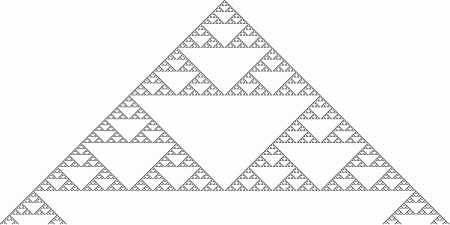
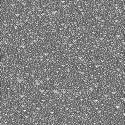
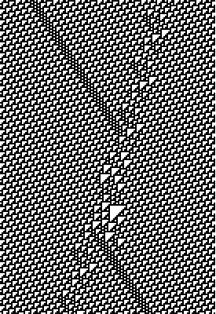
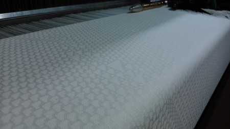

 

I’ve been interested for a while in cellular automata, pattern generating mathematical formulae such as [Rule 90](http://en.wikipedia.org/wiki/Rule_90 "Rule 90"). 

There are many of these rules, each generating different behaviour. Each rule generates the content of cells in a column based on the cells in the preceding column, and are each based upon given starting conditions. 

These are the rules for Rule 90:

|   **current pattern**   |   **111**   |   **110**   |   **101**   |   **100**   |   **011**   |   **010**   |   **001**   |   **000**   |
| --- | --- | --- | --- | --- | --- | --- | --- | --- |
|   **new state for center cell**   |   0   |   1   |   0   |   1   |   1   |   0   |   1   |   0   |

<!--more-->

 This Rule tends to produce triangle like patterns. The pattern generated depends upon the starting condition and emerges from it. Some patterns repeat themselves endlessly, some are static, some appear very ordered, others are random, and some appear to have ordered elements emerging from apparent chaos.

 How does this get to weaving though? Well, I have access to a Jacquard loom, and at the end of each bolt of cloth that I have to weave for work purposes, I always have to weave a metre of wastage in order that there is still something for the loom to grip onto after I cut off the woven cloth. Usually, this cloth would simply be thrown away or used for oil rags, but I like to keep my hand in with the weaving, and this loom is perfect for this purpose.

 Regular shaft looms are not suitable for the purpose of weaving cellular automata as they rarely come in more than 16 shafts, which means that effectively you have a repeat of 16 warp ends in width. This would mean that our cellular automata would have to repeat on 16 cells indefinitely, which wouldn’t yield a great deal of variety. In addition, they usually have to be programmed by hand, using pegs hammered into wooden bars, and that takes a while. 

A note on weaving technology. A woven cloth is made of two sets of threads, which intersect each other at a right angle. The threads that run the length of the cloth are called the Warp, and these are mounted on the loom, held under tension between the warp beam, which has the warp wound on it, and the cloth beam, which has the woven cloth wound on it. The threads that go back and forth across the width are called the weft, and these are inserted one at a time during the weaving process.

Each loom has a Shedding Mechanism, this is a mechanical means whereby a Shed is produced. A shed is a gap between the warp threads through which the weft can pass, and it is changed with each pick of the weft.

On a shaft loom, the shedding mechanism consists of lifting Shafts (rectangular frames). On each shaft is mounted Heddles, one for each warp thread, or end. The pattern of the woven cloth is dictated by the order in which the warp ends pass through heddles on the shafts, and also the order in which the sheds are made.

A Jacquard loom is a little different. On this type of loom, the warp ends are attached to hooks, in our case, there are 864 hooks and three warp ends attached to each hook. This means that there are 864 ends in a repeat, and this cloth is repeated three times.

Also, each repeat is 1’ in width, and there are 72 end in an inch. 

The pattern woven on this loom is dictated by a file on a USB stick. The weaving file is created by taking an image and applying Base Weave (simple repeating woven structures) to different coloured areas, a bit like a paint by numbers thing. The base weaves selected dictate the woven pattern and also which weft is used in which pick, allowing for a great variety in colour and shading.

The purist in me wanted to make a generated cloth with a  table 864 cells wide, but this is impractical in technical terms due to the irregularity of the generated pattern which would most likely produce a technically and aesthetically unpleasant cloth. So I decided it would be better to have each cell represent a single unit of a typical base weave. In this case I chose the black cells to be reprented by a 3/1 warp-faced twill and the white cells to be represented by a 1/3 weft faced twill. This would allow the cloth to be structurally sound and aesthetically pleasing no matter how irregular the pattern generated by the Rule. In this case, it means that the initial condition has to be 216 cells wide.

Also, I kind of did this on a whim and being a busy guy I haven’t got round to creating a python script to generate raw jpegs based on Rule 90 input. So, I just took an image of a Rule 90 pattern from google, cleaned it up a little bit and threw it into the loom.

\[caption id="" align="alignnone" width="216"\] The image after cleaning, before being converted to a weaving file\[/caption\]

I meant to weave it originally with a white warp and a coloured weft, but I accidentally used a white weft and didn’t notice for a few minutes. However, I like the results.

\[caption id="attachment\_1978" align="alignnone" width="450"\] The cloth woven on the machine. The differing base weaves mean that the "black" and "white" sections of the pattern have a different reflective value due to the differing directions of twist of the fibres in the yarn, which gives it a lustrous silk-like appearance despite being made entirely of one shade of off-white cotton\[/caption\]

 **What’s Next** 

Next I plan to create a python script that’ll generate Wolfram Rule patterns in jpeg format, with each cell being represents as either a single pixel or 2 x 2 or 4 x 4 pixels. I would also like to be able to find what patterns, if any, repeat cleanly across the width, so that I could weave a repeating cloth without there being apparent vertical lines in the cloth. This is probably something I will need to set a python script to churn away at for a wee while. With 216 cells, there’s a lot of possibilities. This many, in fact:

1.0531229e+65

Google gave me that after I entered “2 to the power of 216”. I assume the “e+65” means “65 zeroes on the end of this number”. I don’t even know how many millions of millions that is. Good thing I’ve got a spare laptop that’s not doing anything important right now. Poor wee thing.

 Has anyone else done anything similar with cellular automata or fractal generation in an artistic context? I'd love to think I'm the first person to weave a wolfram rule, but I'd be surprised if it hadn't been done already by a mathemetician with an interest in weaving as opposed to a weaver with an interest in mathematics.
