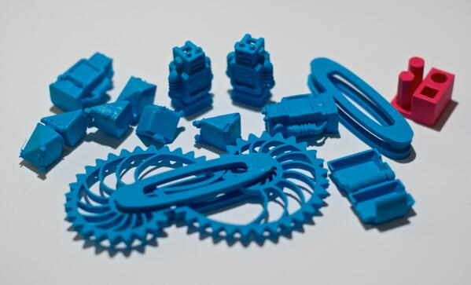

Hacklab member Gary Martin has a new shiny gadget: an Ultimaker 2 3D printer. This Thursday from around 19:00 Gary will host an informal workshop to demo some of the software, print some widgets, and bring along his stash of test 3D prints for closer examination (some seen in the photo above). Gary has been experimenting in different filament materials including PLA, PLA-flex, XT, PLA/PHA, and ABS.

Come down and join us on Thursday 20th at 19:00 to possibly see a working 3D printer. If you have a working 3D printer of your own, feel free to bring that down too and we'll have a play!
