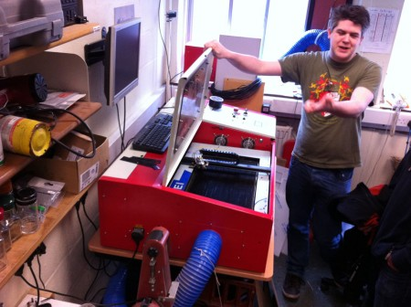

\[caption id="attachment\_2136" align="alignnone" width="450"\] Ted explains to the Software Society how to operate the laser cutter with the lid open. Image courtesy of The Software Society.\[/caption\]

On Saturday we had a visit from around a dozen members of [The Software Society](http://thesoftwaresociety.org.uk/) of Dundee, who are currently pondering upon setting up their own space. Ted, Gareth and Gandolf showed them round and talked a little about what we went through in setting up the lab.

We're planning an away team trip to Dundee on the 8th May 2014 to talk to those who didn't have the opportunity to travel down, and do a bit more of a formal presentation.
