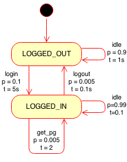
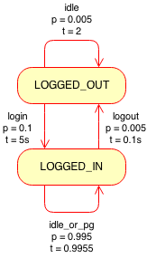

my task

_"connect 80k simultaneous clients, logging in and out at an overall rate of 50Hz, and requesting pages at an overall rate of 100Hz"_

lets model a client as a random walk on a state graph (a Markov chain), where the action taken by a client is drawn from a distribution conditioned on the current action. (TL;DR we will bootstrap frequency estimates from this representation using eigenvectors)

[](http://edinburghhacklab.com/wp-content/uploads/2014/03/MarkovControl.png)

<!--more-->

## forward model

Hmm, logging in takes 5 seconds, logging out 0.1 seconds, and requesting a page 2 seconds. What should the settings of the probabilities be to achieve the correct frequencies? To answer that, we need to know what are the resultant frequencies (in Hz) of actions when the wall clock times and probabilities are defined (the forward model). Consider an agent that first has to login before it can do other things, like request a page. For testing we also allow it to do nothing for one second:

```
"login:"  :{"from":"LOGGED_OUT",  "to":"LOGGED_IN",  "t":5, "p":0.1},
"idle1:"  :{"from":"LOGGED_OUT",  "to":"LOGGED_OUT", "t":1, "p":0.9},
"logout:" :{"from":"LOGGED_IN",   "to":"LOGGED_OUT", "t":.1,"p":0.005},
"get_pg:" :{"from":"LOGGED_IN",   "to":"LOGGED_IN",  "t":2, "p":0.005},
"idle2:"  :{"from":"LOGGED_IN",   "to":"LOGGED_IN",  "t":1, "p":0.99},
```

## convert to simple graph

The canonical form of Markov process is its transition matrix, which does not allow more than one action having the same start and end state. Both _idle2_ and _get\_pg_ actions start and end in the _LOGGED\_IN_ state, so we need to convert them into a single action. The expected time of this combined action, _idle\_or\_pg_ is the weighted average of their times. The overall probability of taking the combined action is the sum of the two probabilities, yielding

```
"login:"      :{"from":"LOGGED_OUT",  "to":"LOGGED_IN",  "t":5, "p":0.1},
"idle1:"      :{"from":"LOGGED_OUT",  "to":"LOGGED_OUT", "t":1, "p":0.9},
"logout:"     :{"from":"LOGGED_IN",   "to":"LOGGED_OUT", "t":.1,"p":0.005},
"idle_or_pg:" :{"from":"LOGGED_IN",   "to":"LOGGED_IN",  "t":0.9955, "p":0.995}
```

[](http://edinburghhacklab.com/wp-content/uploads/2014/03/MarkovControl-1.png)

## convert to matrix form

```
transition_matrix = 
[[ 0.9    0.1  ]  #row for LOGGED_OUT -> (LOGGED_OUT, LOGGED_IN)
 [ 0.005  0.995]] #row for LOGGED_IN  -> (LOGGED_OUT, LOGGED_IN)
```

also we need to represent the time each action takes with a _time\_matrix_

```
time_matrix = 
[[ 1. 5. ]
 [ 0.1         1.00502513]]
```

## calculate stationary distribution

Intuitively, the stationary distribution, when propagated through the transition matrix, results in the stationary distribution.

```
np.dot(stationary_dist, transition_matrix) is always the stationary_dist
```

This is quite like an eigenvector description, just normalised from the influence of probability. Take the eigenvector with an eigenvalue of one and normalise it to find the stationary distribution:

```
eigenvalues, eigenvectors = left_eig(transition_matrix)
index = np.where(eigenvalues == 1)[0][0]
eigenvector = eigenvectors[index]
stationary_dist = eigenvector / sum(eigenvector)
```

for our settings we are much more likely to be logged in than out:

```
stationary_dist = [ 0.04761905  0.95238095]
```

this as the distribution of states when the Markov chain reaches equilibrium. But this does not tell us about the speed the system logs in an out at. In order to integrate time information, we need to first find out the probability of taking an edge when in equilibrium. The transition matrix provides a conditional distribution of taking an edge _given the current state_, so the likelihood of an edge from x->y is the stationary probability of being in state x \* edge\_probability of x|y.

```
edge_prob =
[[ 0.04285714  0.0047619 ]   # 0.04761905*0.9,   0.04761905*0.1
 [ 0.0047619   0.94761905]]  # 0.95238095*0.005, 0.95238095*0.995
```

Ahhh! Interesting, note how the logout -> login probability now matches the logout -> login probability, because of course, you must login as fast as you logout when in equilibrium.

## integrate time

The time spent doing an edge, is its wall clock time multiplied by its likelihood

```
time_per_edge = np.multiply(edge_prob, time_matrix) #element wise multiplication
total_time = sum(sum(time_per_edge)) #1.01952380952
```

The mean return time, is normally described as 1/p(state), but that text book definition does not take into account non-unit times of actions. In our case the mean return wall clock time (for an edge) is total\_time/edge\_prob

```
total_time/edge_prob = 
[[  23.78888889  214.1       ]
 [ 214.1           1.0758794 ]]
```

This matrix states that, on average, _idle\_or\_pg_ transition is taken every 1.0758 seconds. So this states that it is relatively rare that login or logout is actually taken (because the system prefers idling instead). To convert mean times to frequency you just invert

```
frequency_hz = edge_prob/total_time = 
[[ 0.04203643  0.00467071]
 [ 0.00467071  0.92947221]]
```

## convert back to complex graph

Now to undo the damage done when converting to a simple graph. Separating out the _idle\_or\_pg_ back into its constituent parts is just the ratio of probabilities contributed.

```
frequency_idle2 = 0.92947221 * 0.99  / 0.995 = 0.924801495 Hz
frequency_pg    = 0.92947221 * 0.005 / 0.995 = 0.004670715 Hz
```

So we can now present the original system _with frequencies_

```

login:  {'Hz': 0.00467, 'to': 'LOGGED_IN',  'from': 'LOGGED_OUT', 't': 5,   'p': 0.1}
idle1:  {'Hz': 0.04204, 'to': 'LOGGED_OUT', 'from': 'LOGGED_OUT', 't': 1,   'p': 0.9}
logout: {'Hz': 0.00467, 'to': 'LOGGED_OUT', 'from': 'LOGGED_IN',  't': 0.1, 'p': 0.005}
get_pg: {'Hz': 0.00467, 'to': 'LOGGED_IN',  'from': 'LOGGED_IN',  't': 2,   'p': 0.005}
idle2:  {'Hz': 0.92480, 'to': 'LOGGED_IN',  'from': 'LOGGED_IN',  't': 1,   'p': 0.99}
```

## conclusion

Now I can go some way towards finding the right settings for the Markov chain in order to satisfy my boss's testing requirements. No more randomly changing parameters until approximately close to the mandated testing scenario!

I have **not** developed a function that goes from desired frequencies to Markov probabilities because it's under constrained. There are many settings that lead to the correct stationary distribution, however, many of these are not good testing scenarios. For example, my system starts with all clients in the _LOGGED\_OUT_ state. I do not want a high login probability in the transition matrix because then the freshly initialised clients will flood the system with login attempts. So I prefer tuning the transition matrices by hand. I can do this much faster now because the forward model saves me spinning up the actual load test _and waiting for it to reach equilibrium_.

If, however, you did want want to generate a valid set of probabilities for a desired set of frequencies, simply search the forward model in the parameter space.
