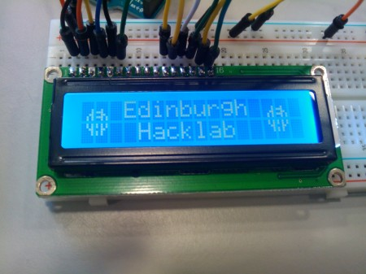

\[caption id="" align="alignright" width="450"\] Photo Peter Jackson - Creative Commons\[/caption\]

A one-day Arduino workshop hosted by Edinburgh Hacklab. Following on from Getting Started with Arduino Workshop the workshop assumes some previous knowledge and use of Arduino. If you've attended the Arduino workshop at the Hacklab then your ready to continue learning where you left off.

Topics covered include:

- Using a Liquid Crystal Display (LCD)
- Saving values between Ardunio power-offs
- Playing Sounds
- Controlling Motors/Servos
- Connecting to a Network
- Making your project tiny and power efficient
- And more!

We assume you already have an Arduino to bring with you. We will have Arduinos available to borrow for the day if you left your's at home or to buy if you want a 2nd one or blew yours up! Electronic components you need for the workshop are provided. You will need to bring a laptop to program the Arduino with.  
  
The workshop will take place from 10:30am to about 5:00pm, with a break for lunch. Tea and coffee will be provided, Summerhall has a cafe for food or you're welcome to bring a packed lunch.  
  
[Book now!](http://edinnextarduino-ws.eventbrite.co.uk)  
  
If debit or credit cards aren't your thing please email treasurer@edinburghhacklab.com to arrange an alternative method of payment.
