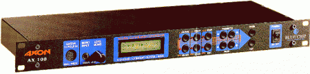
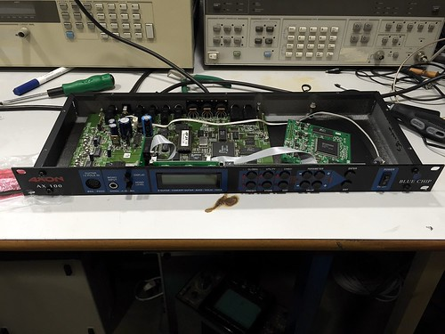
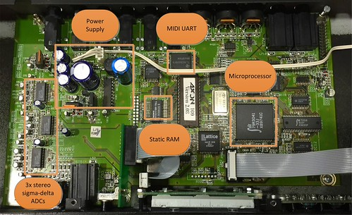
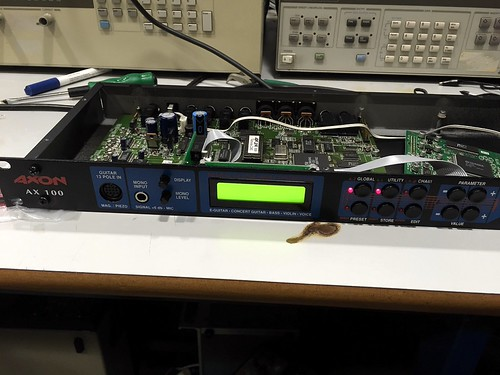
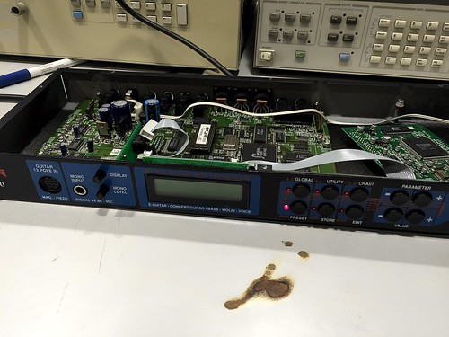
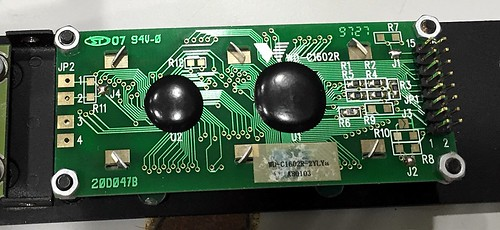

Gareth writes: I've wanted a Guitar-to-MIDI converter (a.k.a. a guitar synth) for yonks. In particular, I've been looking for an Axon AX 100 unit; they were renowned for the speed and accuracy of the tracking that the proprietary neural network software could achieve. Unfortunately the AX 100 has been out of production for years, and used units are commanding prices in the high hundreds of pounds. However, I recently found a reasonably priced spares-or-repair unit on eBay, so I picked it up.

<!--more-->

The Axon AX-100 was originally designed in Germany by Blue Chip Audio in the 1990s, then the company was acquired by Terratec, who slowly strangled the product line.

Here's a video of Burr Johnson demonstrating the Mark II unit. If you can cope with the cheesy synth patches he's using, it's a good explanation of what a guitar synthesiser can do.

https://www.youtube.com/watch?v=VbFIpRNnqSI

I picked up a spares-or-repair unit on eBay recently and on Saturday I got down to the business of repair. This is one of the original Mark I units from Blue Chip Audio, built in 1998; it can be seen below. The seller had said that it wasn't starting up and that the NiCad had leaked; he had removed that NiCad from the board before shipping.

Internally, none of the parts looked to be non-standard apart from the programming of the EPROM and the Lattice PLDs that are in it, so I was optimistic that any failures could be repaired without having to locate another unit to cannibalise. There was a small amount of corrosion around the NiCad site, but nothing too sinister. The picture below shows the board layout with my interpretation of the devices and functions on it.

Powering up the unit showed two LEDs and the LCD backlight on the front panel coming on, but no further life from the unit, as shown in the picture below.

The NiCad battery that was removed sits next to a SRAM device that holds the settings and customisation for the box; everything I'd read on the NiCad failure (and it seems to be a common failure mode) suggested that the only symptom would be no retention between power cycles, rather than an outright failure. Something else was wrong.

Disconnecting the Yamaha synthesiser board made no difference to the behaviour; this was disappointing, as I am not planning to use the Yamaha synth card if I can repair the unit.

Al suggested disconnecting the display and trying again, and that stroke of genius was a big step forward. About a second after the same two LEDs lit as before, they went out and one LED lit elsewhere on the panel, and I could move the lit LED around the front panel by pressing the corresponding buttons.

 by Gareth Edwards, on Flickr")

A bit of investigation of the type number of the LCD showed that it was a 16x2 with a standard interface, but the pinout was somewhat unusual. Most 16x2 LCD units these days have solder holes along one edge for hardwiring a harness to, but this had a two-row IDC header connector on it. A bit of digging yielded an equivalent Midas part to the original.

So now I wait for the replacement LCD to arrive, and then part 2 of the post will follow once I've done some testing.

Continue to [part 2](http://edinburghhacklab.com/2015/04/repairing-an-axon-ax-100-pt2/ "Repairing an Axon AX 100 guitar-to-MIDI converter (part 2)").
