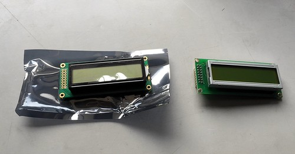
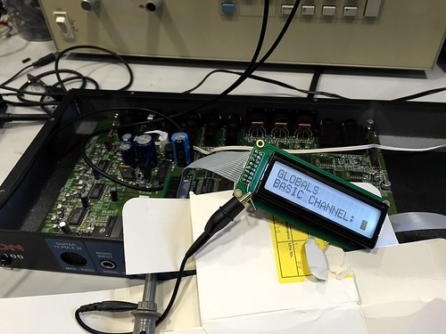

(Return to [Part 1](http://edinburghhacklab.com/2015/03/axon-ax-100-repair-pt1/ "Repairing an Axon AX 100 guitar-to-MIDI converter (part 1)"))

  

So the replacement LCD (a Midas MC21605B6WK-FPTLW) arrived last week, and I headed to the lab to try it out.

  

<!--more-->

The new LCD did not come with the header pins already attached so I scavenged some from the copious lab stock of Useful Things, then plugged in to the board and powered up.

The good news: the board booted (it hadn't booted at all with the old LCD in place).

The bad news: there was nothing on the display.

I fired up the 'scope and started walking down the pins one by one, checking against the [datasheet](http://www.farnell.com/datasheets/1663609.pdf). +5V and GND were OK, but something was odd on the "contrast adjust" pin 3. This should be a constant voltage between 0V and 5V, set by a potentiometer on the front panel of the unit, but what I was seeing on the 'scope was clearly a digital pulse train. A closer look at the connections showed that the ribbon cable jumping from the mezzanine board to the LCD was in fact fitted the wrong way round; this was the state it had arrived in (and I have [the photo to prove it](https://www.flickr.com/photos/gareth_edwards/16897323682/)).

Reversing the connector and re-powering the unit gave this wonderful sight:

While I was soldering in the replacement NiCads, Martin pointed out that the sticker on the EPROM was lifting a bit and it might be a good idea to grab a copy of the firmware while the lid was off. This was a very good idea; EPROMs typically retain contents for 10 to 20 years, and this unit is now 17 years old. We pulled the ROM (a 27256, with a massive 32KB of storage) and grabbed a dump in the programmer.

After a bit of work on the mounting holes with the [rotary hardware editor](http://www.dremeleurope.com/gb/en/) and the application of some of the [Great Joiner Of Things](http://en.wikipedia.org/wiki/Hot-melt_adhesive), everything went back together and a last test of the boot is shown here:

https://www.youtube.com/watch?v=UuazsbiCYYI

Next steps: although the processor now boots, I need to get hold of a "GK-ready" or "synth-ready" guitar to try out the audio pathway and see how the conversion is working. I also might need to adjust the resistor that controls the trickle charge of the NiCad since the parts I've replaced the existing unit with are at least 10x the capacity. Lastly, I'm considering using [radare2](http://www.radare.org/r/) to do some reverse engineering of the firmware to understand how the unit works.
