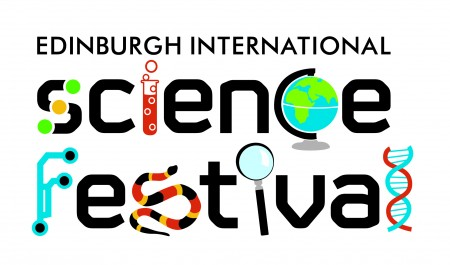

We're pleased to again be part of the Edinburgh International Science Festival. This year's Science Festival is just about to start and the big finale is on the 19th of April when the Edinburgh Mini Maker Faire returns to Summerhall, more on that soon.

Hacklab is running five workshops this Festival, our Paper Circuits workshop has already sold out, but if you're quick there are still a few places available for our soldering workshops:

## Solder on!

Running on **Monday 6 April** and **Wednesday 15 April** at **19:00** This workshop is our introduction to soldering. Want to take your breadboarded projects and make them permanent? Fed up with wires falling out? Soldering is for you! [More info and booking](http://www.sciencefestival.co.uk/event-details/Solder-On!).

## Extreme Soldering: Surface Mount Components

Running on **Wednesday 8 April** and **Monday 13 April** at **19:00** Modern electronic components are Surface Mount Devices (SMD). This tiny little parts look difficult to solder and lots of people are put off evern trying. In this workshop we'll show you that not only is it possible, but SMD soldering is easy! [More info and booking](http://www.sciencefestival.co.uk/event-details/extreme-soldering-surface-mount-components).

The price of both workshops includes a blinky LED kit to make and take away! These cute kits are great practice and the LEDs will mesmerise you for hours\*.

Our workshops sold out last year, book now to avoid disappointment!

\* Not a guarantee but Peter has stared at his for days.
