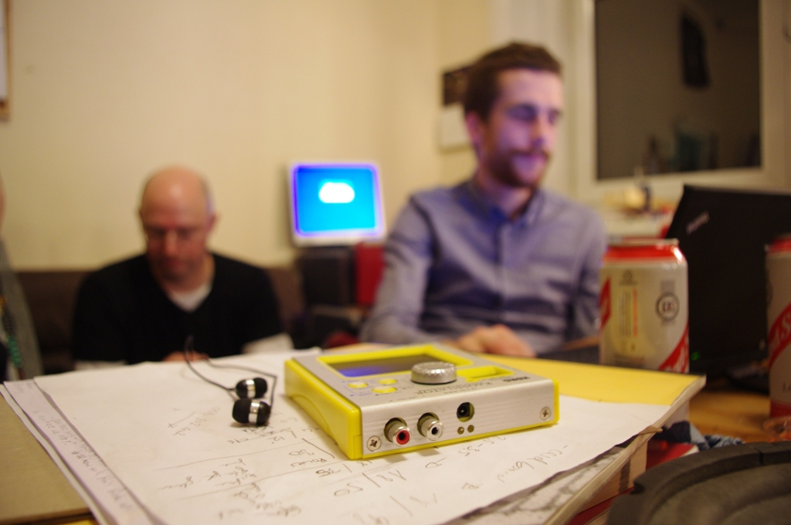

A long time ago, in a lab far, far, away...

... in Leith, we used to have a regular [music and audio night](http://edinburghhacklab.com/2011/11/music-night-was-awesome-official/) and we'd like to start that off again.

Our plan is to use the existing open night on the first Thursday of every month as a Music/Audio themed evening.

The first evening of the new run will be on Thursday 7th May starting at around 7:30pm at the lab.

Some of the things that might happen then include:

- exploring the possibilities of a newly repaired guitar synth from '98
- trying to build something with PT2399 delay ICs
- working on an AY-3-8912 controlled by MIDI through an Arduino, and playing with similar SID and FM chips
- distortion pedal shenanigans
- we can record some or all of the results to my newly acquired 4-track cassette deck.

Look forward to seeing you all there!
