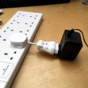
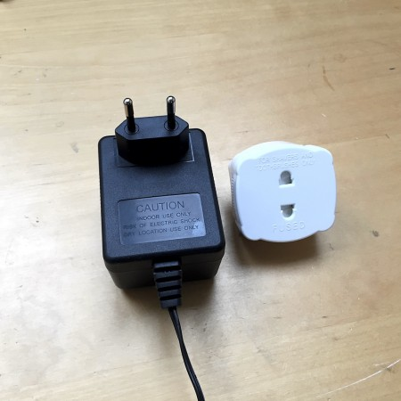
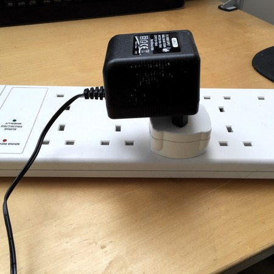
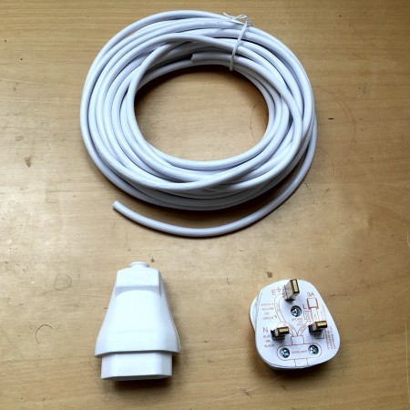
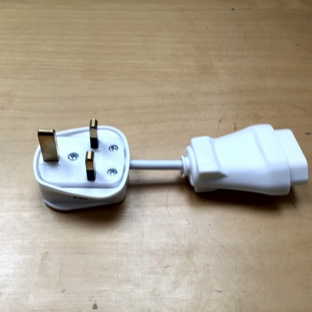

I have a few guitar pedals and effects units that came from continental Europe and therefore have a two-pronged "Europlug" for power.

Inspired by [power extension cords](http://www.winfordeng.com/products/pwrext.php), I've built some adapter cords that solve a couple of problems neatly.

<!--more-->

  

The traditional method of plugging a Europlug power supply into a socket uses a travel adapter or shaving adapter, as shown below.

Using this on a power strip (which is the ubiquitous method for powering guitar pedal or effects units) leads to a couple of problems:

- the asymmetry of the power supply coupled with the general mechanical crappiness of the contacts in shaver adapters means that power supply at the very least sits at a funny angle, and at worst has a unreliable electrical connection to the mains;
- the positioning of the power supply can potentially block the socket next to it in the power strip.

Gathering together materials: Some 13-amp plugs fitted with 3A fuses; some 6A two-core electrical cable; and some inline Europlug trailing sockets. The latter took a bit of finding; I bought mine from eBay seller [mikdan75](http://ww.ebay.co.uk/usr/mikdan75)

.

