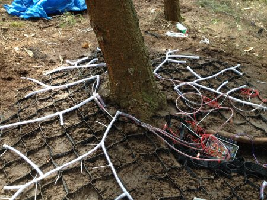

If you've been in the lab during the day in the first couple of months this year there's a good chance you've found me, Andrea and Random sweating over LED strips, surrounded by wires and PVC tubing. It was all assembly work for an artwork called Sentient Forest, which has now been installed in its new home in the [Forest of Dean Sculpture Trail](http://www.forestofdean-sculpture.org.uk/) (well worth a visit if you're down there!).

The piece was created by Edinburgh artist Andrea Roe to show the hidden world of mycelium, a fungi that lives below the soil around trees, forming a symbiotic relationship with the trees above, and possibly communicating with the surrounding forest. Mycelium grows outwards from the trees in a tendril-type pattern, so the challenge was to try and replicate this using LED strip and show the movement of information through the fungus. The whole thing needs to be off-grid solar/battery powered, quietly charging itself until it's triggered by people walking by. And it needed to be invisibly installed in a damp forest hundreds of miles away...

The final piece incorporates around 60m of addressable WS2812B (NeoPixel) LED strip, three Teensy microcontrollers, two PIR modules, a 100W solar panel, 100AH lead acid battery, eleventy billion meters of cable and 14 tubes of silicone sealant.

Here are some behind the scenes photos of it being built:

\[gallery link="file" size="medium" ids="2459,2460,2462,2463,2466,2464,2461,2465,2467,2468,2469,2470,2484,2472"\]

 

  
And here's the final piece, doing it's thing: 
