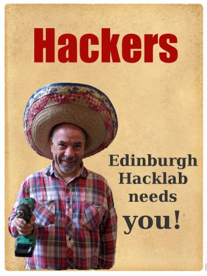
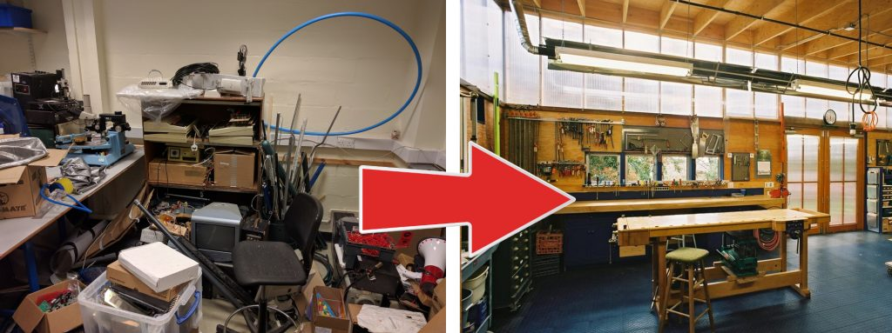

Your favourite hackerspace is about to get bigger. An empty room became available near our current "suite" of rooms, we've snapped it up, and we have a plan...

If you've visited the lab and taken the tour, you'll have seen our current storeroom is quite big but our workshop is quite small. We're going to fix this by moving members storage to the new, smaller room and then refit G8 (the current storeroom) to be an **epic workshop**!

Since we improved our small workshop (room G2) with a new bench last year it's been well used. It's one of the few publicly accessible workshops in Edinburgh, so it can get pretty crowded. We're also really tight on room in there, we can't add any more big tools, like a table saw, CNC mill etc. So, let's refit G8 to be a great workshop with room for lots of people to hack at once, and space to add to our library of tools. <!--more--> We're already talking about new CNC and adding new and exciting tools, it'll look something like this:

Good plan, eh? Our only problem is budget. We can't really afford the extra room, and the refit, without **your help**. We need a few new members to cover the additional monthly cost, if you're a semi-regular visitor to the lab and have been [considering joining](http://edinburghhacklab.com/join/), now would be a most excellent time to come to an open night and grab a membership form! Membership gives you 24/7 access to the lab and its facilities, including the epic new workshop!

Far away? Don't visit often? Would still like to help? Donate and become [a Friend of Hacklab](http://edinburghhacklab.com/donate/)!

Whatever happens, we'll need people to help with the refit, planning the new layout, ordering materials, building benches etc. Please sign up to our discuss list for new room chat. [Come along to our Tuesday open nights](http://edinburghhacklab.com/events/) to see how things are progressing, hopefully you'll be able to make use of the new room soon!
