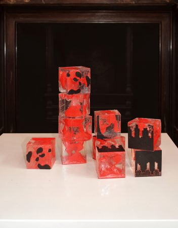

Recently our Ultimaker 3D printer was kept busy for a few days printing strangely-shaped pieces for Edinburgh-based artist [Penelope Kay](http://www.penelopeskay.co.uk/). Penny had been working with Dr Thomas Pratt of Edinburgh University to create strange pseudo-organic shapes that blur the lines between diagrams and the the real world. The 3D printed pieces were encapsulated in medical-grade resin to make a stackable and re-arrangeable artwork. It's always great to see interesting things being made in the lab, and satisfying to know we've helped bring something to fruition.<!--more-->

Here's some background on the work, and of the pieces being exhibited at a recent conference:

> An installation by Penelope Kay, recent graduate from Sculpture, Edinburgh College of Art and Dr. Thomas Pratt, lecturer in morphogenesis at The University of Edinburgh.
> 
> Artists and scientists both try to get things onto a flat surface in order to communicate their ideas. An artist may draw or paint on a two dimensional surface, a scientist may write a report and draw diagrams. This work explores the relationship between two dimensional information and the multi-dimensional world.
> 
> The collaboration has resulted in an interactive installation in which delegates are invited to pick up cubes and move them around a table to make their own construction. The cubes can be put together in different combinations by matching the diagrams on the faces of each cube to make various permutations, each creating a new interpretation of the ten cube world.
> 
> The diagrams on the faces of the cubes are taken from papers of special interest to Tom. Two, the histogram and dapples, are from Alan Turing’s ‘Chemical basis of Morphogenesis’ (1952). The hourglass shaped brain section is from a recent paper by Dr. James Clegg et al, and the graph and bead diagram are from a paper in progress by Dr. Calvin Chan.
> 
> Special thanks to the Edinburgh Hacklab, in particular, Random Switch and Daniel Connell who have shared their technical skills and been immeasurably helpful in producing the cubes.

\[gallery ids="2520,2519,2517,2516,2515"\]
