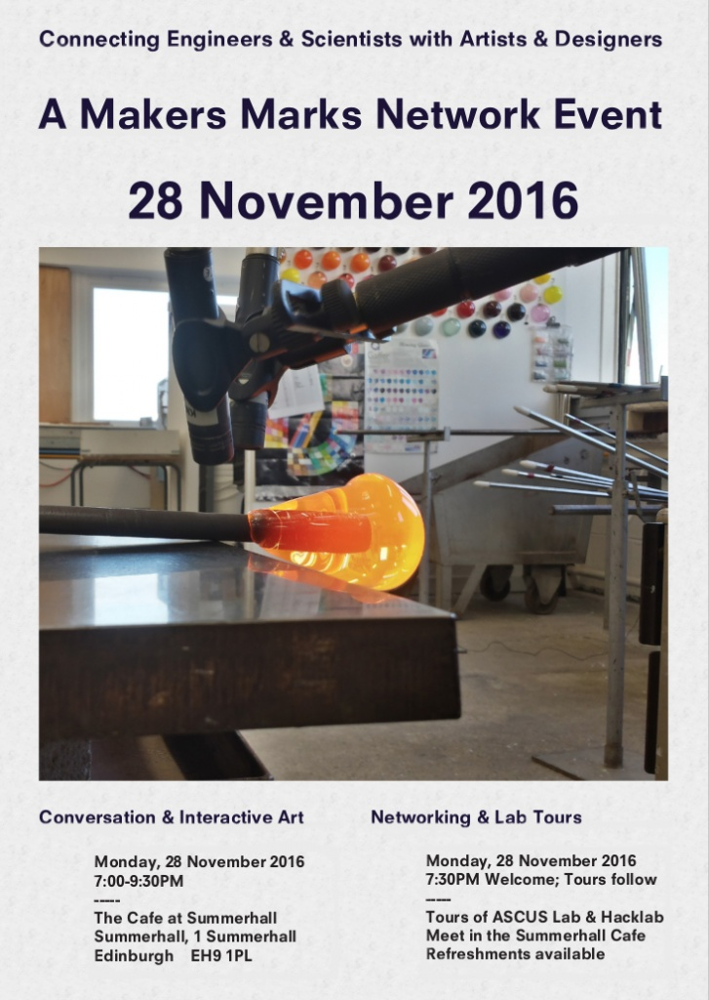
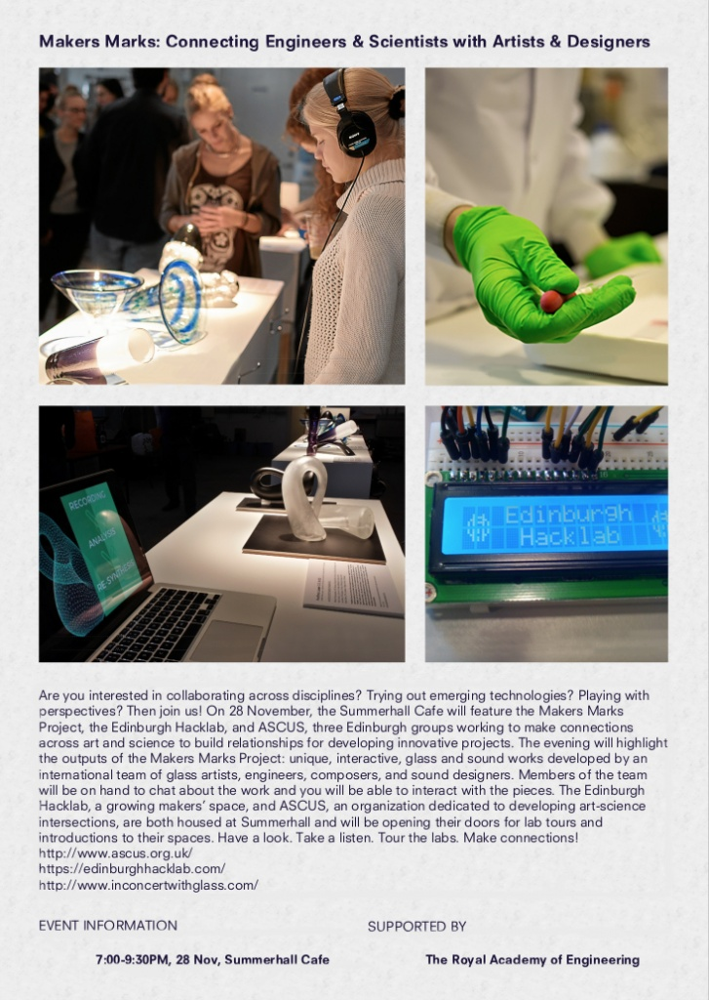

Hacklab member Al (who writes in the third person) is helping to organise an event at Summerhall on Monday 28th of November to show some glass pieces that are the output of a collaborative art project, combining glass blowing and casting, electronics, sound design and composition.

The event will include some brief presentations about collaborative art, tours of both the Hacklab and ASCUS' bio lab, and a chance to meet and discuss cross-disciplinary projects and ideas over a pie and beer. All in all it should be a fun event and all are welcome. More [details are here](https://www.facebook.com/events/762178967254530/), simply sign up to the [Eventbrite event](https://www.eventbrite.co.uk/e/makers-marks-connecting-engineers-scientists-with-artists-designers-tickets-29513971082) so we can estimate numbers and order the right number of pies!

