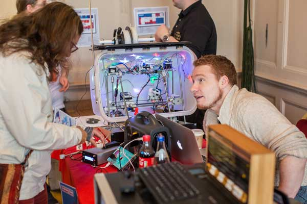
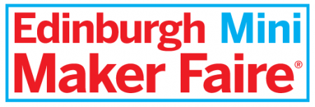

Welcome to 2017!

[Edinburgh's Mini Maker Faire](http://edinburgh.makerfaire.com/) returns this year on **Sunday 16 April 2017**. It takes place at Summerhall, right on our doorstep, and is a great chance to meet like minded folk from other hackerspaces, see interesting things that people are working on and play with robots.

For this to happen, the Faire needs makers to bring their stuff to Edinburgh's biggest nerdy show and tell, that means you!

Here's some of the stuff the Maker Faire is looking for:

- 3D printers and digital fabrication
- Biology/biotech and chemistry projects
- Crafts and design
- Drones, rockers and remote control toys
- Gadgets, inventions and hacks of any sort
- Glass and ceramics
- Food tech and hacks
- Foundry and blacksmithing
- Electronics, Arduino and Raspberry Pi projects
- Kinetic, fire and installation art
- Music performances and instruments
- Puppets and props
- Radios, vintage computers and game systems
- Robotics, homemade robots
- Shelters, tents and domes
- Sustainable transportation, bicycles and human-powered machines
- Textiles and arts and crafts
- Unusual tools or machines
- Wearables, e-textiles, fashion tech
- Young makers and school maker clubs

If you're making something like this, [find out more and submit your application form](http://edinburgh.makerfaire.com/2016/12/09/call-makers-2017/) now by the end of January to get your space!
