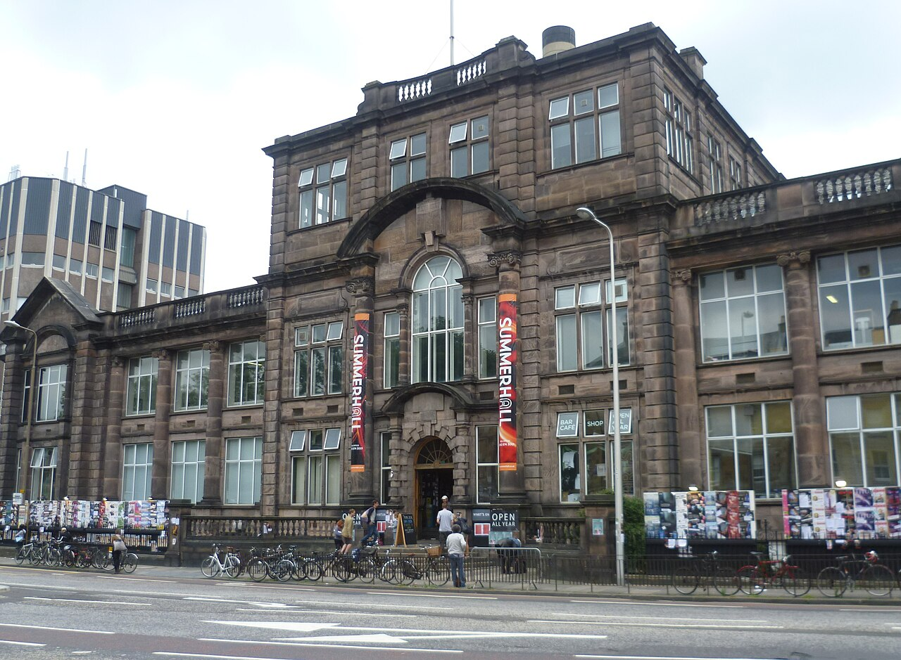

<figure>

<figcaption>

Summerhall main building. (C) Kim Traynor, Creative Commons Attribution-Share Alike 3.0 Unported

</figcaption>

</figure>

Summerhall, the arts complex where the Hacklab is based, has been put up for sale. We became aware that the public may only know Summerhall as an events venue, and not realise how many artists and businesses have studios and workshops here. For that reason, residents at Summerhall are offering tours to show some of what happens here.

If you would like to join a tour, just turn up outside the Hacklab, by the sign in our window in the courtyard of Summerhall, at any of the following times:

14th and 15th August 2024 at 1200, 1400, and 1600.

You can also contact organisers via the Hacklab IRC/Discord/email/phone.

#MadeInSummerhall

News of sale: [https://www.theguardian.com/uk-news/article/2024/jun/03/summerhalls-sale-could-devastate-edinburghs-arts-scene-say-creative-leaders](https://www.theguardian.com/uk-news/article/2024/jun/03/summerhalls-sale-could-devastate-edinburghs-arts-scene-say-creative-leaders)
